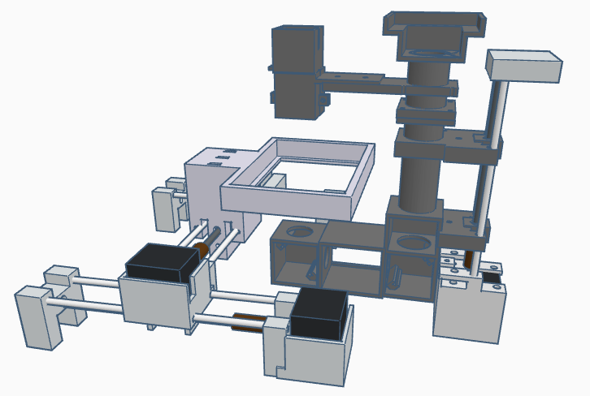

# micro3D: Custom 3D-Printed Microscope for TIE Phase Retrieval

This repository contains the 3D-printable components and design files for a custom-built microscope optimized for **Transport of Intensity Equation (TIE)** phase retrieval. The design focuses on a direct ETL (Electrically Tunable Lens) configuration to minimize optical complexity and instrument footprint.

## Overview

The microscope is designed to enable axial displacement of the focal plane through an integrated ETL. This allows for the rapid acquisition of multifocal image stacks at different defocus distances without mechanical movement of the sample, which is essential for quantitative phase imaging.

### Key Features:
* **Direct ETL Configuration:** Simplified optical path to minimize aberrations.
* **Reduced Footprint:** Incorporation of two first-surface mirrors to fold the optical path and minimize the instrument's volume.
* **Phase Stability:** Validated setup that eliminates spurious quadratic phase terms during lateral sample translation.
* **Modular Design:** 3D-printed parts for easy customization and repair.

---

## System Visualization

*Figure 1: 3D render of the microscope components and optical layout.*

---

---

## 🔧 Assembly & Hardware Details

The mechanical assembly and electronic control are divided into two main modules to ensure precise movement and lighting management.

### Motion & Lighting Control
* **X-Y Axis Control:** Driven by **two NEMA 17 stepper motors** for precise lateral sample positioning.
* **Z-Axis & Lighting:** A **third NEMA 17 motor** controls the axial displacement (focus), while the system integrates the microscope's illumination control.
* **Electronics:**
    * **2 × Arduino Uno** boards (distributed control).
    * **Adafruit Motor Shield v2** on each Arduino for high-resolution motor stepping.

### Mechanical Specifications
* **Drive Mechanism:** 5 mm threaded rods coupled with the motors, using corresponding hexagonal nuts to translate rotational motion into linear displacement.
* **Support Rods:** 4 mm diameter **stainless steel rods** used as linear guides to ensure smooth and rigid travel.
* **Stability Tip:** It is highly recommended to mount the 3D-printed assembly within an **external aluminum frame** to guarantee system stability and minimize mechanical vibrations during image acquisition.

---

## Setup & Calibration

1.  **Mechanical Alignment:** Ensure the 4 mm stainless steel rods are perfectly parallel to prevent friction or jamming in the X, Y, and Z stages.
2.  **Motor Configuration:** One Arduino/Shield pair is dedicated to the X-Y stage, while the second pair manages the Z-axis and the illumination intensity.
3.  **Vibration Dampening:** Tighten all 5 mm nuts and ensure the aluminum structure is properly leveled.

## Software Architecture & Control Logic

The system operates through a **Master-Slave architecture** where a Python-based controller orchestrates the hardware via serial communication.

### 1. High-Level Controller (Python)
The `main_controller.py` script manages hardware synchronization:
* **Automatic Device Discovery:** Identifies `Arduino_1` (XY), `Arduino_2` (Z/Light), and the **Optotune ETL** via a handshake protocol (sending '0').
* **Asynchronous Processing:** Uses `multiprocessing` to run hardware control and the uEye camera live feed in parallel.
* **Event-Driven Input:** A keyboard listener maps specific keys to serial commands.

### 2. Firmware Logic (C++/Arduino)
Both Arduinos run a command-listener loop at **115,200 baud**.

* **Arduino 1 (XY Stage):** Handles fine stepping (10 steps) and fast travel (1000 steps) for the X and Y axes.
* **Arduino 2 (Z-Axis & Light):** Manages vertical focus displacement and toggles digital pins (8/9 and 12/13) for illumination control.

---

## ⌨️ Control Mapping Reference

| Key | Action | Target Device | Command Sent |
| :--- | :--- | :--- | :--- |
| **W / S** | Move X-Axis (Fine) | Arduino 1 | `1` / `2` |
| **A / D** | Move Y-Axis (Fine) | Arduino 1 | `3` / `4` |
| **I / K** | Move X-Axis (Fast) | Arduino 1 | `5` / `6` |
| **J / L** | Move Y-Axis (Fast) | Arduino 1 | `7` / `8` |
| **Q / E** | Move Z-Axis (Focus) | Arduino 2 | `1` / `2` |
| **U / O** | Toggle Illumination A | Arduino 2 | `3` |
| **F / T** | Toggle Illumination B | Arduino 2 | `4` |
| **Z / X** | +/- ETL Current | Optotune ETL | Serial API |
| **P** | Emergency Stop / Exit | All | — |

---

## References

If you use this design or research in your work, please cite the following publications:

* **Silva, A., Arocena, M., Hochmann, J., Fernández, A., & Alonso, J. R. (2025).** Quantitative phase microscopy for time-lapse hypoxia-induced cellular assays based on the transport of intensity equation. *Applied Optics*, 64(5), 1186-1195.

* **Silva, A., & Alonso, J. R. (2022, August).** Open source electronic platforms and 3d printing for microscopy: a cost-effective approach. In *Latin America Optics and Photonics Conference* (pp. M2C-2). Optica Publishing Group.
---

## Contents
* `/stl`: Standard Tessellation Language files for 3D printing.
* `/scad`: Original OpenSCAD or CAD source files for modifications.

---

## Requirements
* **3D Printer:** FDM or SLA (FDM recommended for structural parts).
* **Material:** PLA, PETG, or ABS.
* **Hardware:** Two first-surface mirrors, Electrically Tunable Lens (ETL), and standard optical cage components.